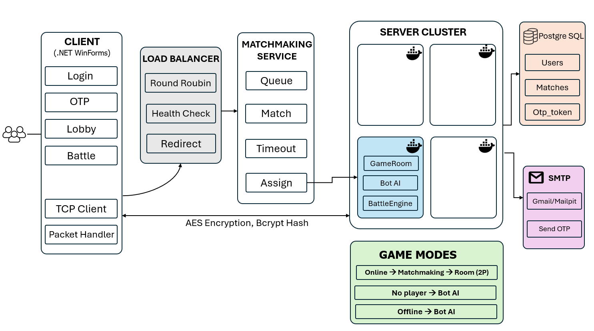

# NT106.Q23.ANTT — LẬP TRÌNH MẠNG CĂN BẢN


## I. Đồ Án Môn Học

**Tên đề tài:** Thiết kế và xây dựng game đối kháng 2D bằng C# trên nền tảng .NET Windows Forms

---

## Danh Sách Thành Viên

| STT | Họ và tên | MSSV | Vai trò |
|---|---|---|---|
| 1 | Lưu Hồng Phúc | 24521382 | Game Architect / Server |
| 2 | Phan Thái Hưng | 24520624 | Gameplay Programmer |
| 3 | Nguyễn Tấn Phát | 24521306 | UI / UX Game Developer |
| 4 | Nguyễn Phan Hoàng Long | 24521006 | Network Programmer |

---

## Mô Tả Tổng Quan

BattleGame là game đối kháng 2D theo thời gian thực qua mạng cục bộ (LAN), được xây dựng bằng C# và Windows Forms. Hai người chơi kết nối tới server trung tâm, chọn nhân vật, được ghép cặp tự động và thi đấu thông qua giao tiếp TCP Socket.

### Các tính năng chính

- Đăng ký tài khoản với xác thực OTP qua Email (SMTP)
- Đăng nhập / xác thực tài khoản người chơi (BCrypt)
- Quên mật khẩu / đặt lại mật khẩu qua OTP Email
- Chọn nhân vật với các chỉ số và kỹ năng riêng biệt
- Hệ thống matchmaking tự động ghép 2 người chơi vào cùng một phòng
- Trận đấu real-time: di chuyển, tấn công, sử dụng kỹ năng
- Đồng bộ trạng thái game liên tục giữa server và các client (50ms/tick)
- Hiển thị animation nhân vật và hiệu ứng chiến đấu
- Hệ thống âm thanh BGM và SFX
- Bot AI tự động thay thế khi không đủ người chơi

### Công nghệ sử dụng

| Thành phần | Công nghệ |
|---|---|
| Ngôn ngữ lập trình | C# (.NET 8) |
| Giao diện | Windows Forms |
| Giao tiếp mạng | TCP Socket (`System.Net.Sockets`) |
| Serialization | Custom `PacketSerializer` (JSON) |
| Mã hóa truyền tin | AES Encryption |
| Cơ sở dữ liệu | PostgreSQL 15 |
| Xác thực mật khẩu | BCrypt (`BCrypt.Net-Next`) |
| Gửi Email OTP | SMTP Gmail / Mailpit (dev local) |
| Container | Docker + Docker Compose |
| Kiểm thử | xUnit (`BattleGame.Test`) |

---

## Yêu Cầu Hệ Thống

| Công cụ | Phiên bản | Ghi chú |
|---|---|---|
| Docker Desktop | 4.x trở lên | Bắt buộc để chạy server + DB + Mailpit |
| .NET SDK | 8.0 | Chỉ cần nếu chạy Client hoặc build tay |
| Visual Studio | 2022 | Để phát triển |
| Windows | 10/11 64-bit | Để chạy Client WinForms |

---

## Sơ đồ kiến trúc hệ thống


---

## Hướng Dẫn Cài Đặt & Chạy

### 1. Clone dự án

```bash
git clone https://github.com/FUCLU/BattleGame.git
cd BattleGameSolution
```

### 2. Tạo file .env

> File `.env` chứa mật khẩu DB và không được commit lên Git.
> Phải tạo thủ công sau khi clone.

```bash
cp .env.example .env
```

Mở file `.env` và điền thông tin:

```env
# PostgreSQL
POSTGRES_DB=battlegame
POSTGRES_USER=postgres
POSTGRES_PASSWORD=your_password_here

# Server
SERVER_PORT=9001

# SMTP — dev local dùng Mailpit (giữ nguyên, không cần sửa)
SMTP_HOST=mailpit
SMTP_PORT=1025
SMTP_USERNAME=test@battlegame.local
SMTP_PASSWORD=
SMTP_ENABLE_SSL=false
```

### 3. Cài NuGet packages (chỉ làm 1 lần)

```bash
dotnet restore
```

Nếu vẫn báo thiếu package, cài thủ công:

```bash
dotnet add BattleGame.Server/BattleGame.Server.csproj package Npgsql
dotnet add BattleGame.Server/BattleGame.Server.csproj package BCrypt.Net-Next
dotnet add BattleGame.Server/BattleGame.Server.csproj package Microsoft.Extensions.Configuration.Json
dotnet add BattleGame.Server/BattleGame.Server.csproj package Microsoft.Extensions.Configuration.EnvironmentVariables
dotnet add BattleGame.Server/BattleGame.Server.csproj package Microsoft.Extensions.Configuration.Binder
```

### 4. Chạy Server + DB bằng Docker

```bash
# Lần đầu hoặc sau khi thay đổi code
docker compose up --build

# Các lần sau (không đổi code)
docker compose up -d
```

Sau khi chạy:
- **Game Server** → `localhost:9001`
- **PostgreSQL** → `localhost:5432`
- **Mailpit Web UI** → http://localhost:8025 (xem email OTP)
- **Mailpit SMTP** → `localhost:1025`

Kiểm tra log:
```bash
docker compose logs server     # log game server
docker compose logs db         # log database
docker compose logs mailpit    # log email
```

Dừng server:
```bash
docker compose down            # dừng, giữ data
docker compose down -v         # dừng và xóa toàn bộ data DB
```

### 5. Chạy Client (WinForms)

> Client **không** chạy trong Docker. Chạy trực tiếp trên máy Windows.

**Cách 1 — Visual Studio:**
1. Mở `BattleGameSolution.slnx`
2. Chuột phải `BattleGame.Client` → **Set as Startup Project**
3. Nhấn **F5**

**Cách 2 — Terminal:**
```bash
cd BattleGame.Client
dotnet run
```

> Mở 2 cửa sổ Client để thử nghiệm matchmaking.
> Client mặc định kết nối `127.0.0.1:9001`.
> Nếu server chạy máy khác, sửa địa chỉ trong `Config/ClientConfig.cs`.

### 6. Debug Server bằng Visual Studio (không dùng Docker)

> Dùng khi muốn đặt breakpoint debug trực tiếp trên server.

1. Chạy chỉ DB và Mailpit trong Docker:
```bash
docker compose up -d db mailpit
```

2. Đảm bảo `Properties/launchSettings.json` có:
```json
{
  "profiles": {
    "BattleGame.Server": {
      "commandName": "Project",
      "environmentVariables": {
        "ASPNETCORE_ENVIRONMENT": "Development"
      }
    }
  }
}
```

3. `appsettings.Development.json` dùng `Host=localhost` để kết nối DB ra ngoài Docker:
```json
{
  "ConnectionStrings": {
    "DefaultConnection": "Host=localhost;Port=5432;Database=battlegame;Username=postgres;Password=battlegame123"
  }
}
```

4. Chuột phải `BattleGame.Server` → **Set as Startup Project** → nhấn **F5**

| Môi trường | `ASPNETCORE_ENVIRONMENT` | Host DB được dùng |
|---|---|---|
| Visual Studio (`dotnet run`) | `Development` | `localhost` |
| Docker (`docker compose up`) | `Production` | `db` |

### 7. Chạy Test

```bash
# Chạy tất cả test
dotnet test BattleGame.Test

# Chỉ test OTP logic (không cần Docker)
dotnet test BattleGame.Test --filter "Category=Otp"

# Kiểm tra toàn bộ cấu hình (cần Docker đang chạy)
dotnet test BattleGame.Test --filter "Category=Setup"
```

---

## Cấu Trúc Dự Án

```
BattleGameSolution/
├── BattleGame.Client/              # Ứng dụng client (WinForms)
│   ├── Forms/
│   │   ├── LoginForm.cs            # Đăng nhập
│   │   ├── RegisterForm.cs         # Đăng ký tài khoản mới
│   │   ├── OtpForm.cs              # Nhập mã OTP 6 số
│   │   ├── ForgotPasswordForm.cs   # Quên mật khẩu → nhận OTP reset
│   │   ├── ResetPasswordForm.cs    # Đặt lại mật khẩu mới
│   │   ├── MenuForm.cs             # Màn hình chính
│   │   ├── CharacterSelection.cs   # Chọn nhân vật
│   │   ├── GameForm.cs             # Màn hình trận đấu
│   │   └── GameOverForm.cs         # Màn hình kết thúc trận
│   ├── Game/
│   │   ├── GameEngine.cs           # Vòng lặp game (60fps)
│   │   ├── GameStateManager.cs     # Quản lý trạng thái game
│   │   ├── AnimationManager.cs     # Quản lý animation spritesheet
│   │   └── CharacterRenderer.cs    # Render nhân vật lên màn hình
│   ├── Managers/
│   │   ├── InputManager.cs         # Xử lý input bàn phím
│   │   ├── SoundManager.cs         # Quản lý âm thanh BGM/SFX
│   │   ├── AssetManager.cs         # Tải và cache tài nguyên (runtime)
│   │   └── NetworkManager.cs       # Trung gian gửi/nhận packet
│   ├── Network/
│   │   ├── ClientSocket.cs         # Kết nối TCP tới server
│   │   ├── MatchmakingClient.cs    # Gửi yêu cầu tìm trận
│   │   └── PacketHandler.cs        # Xử lý packet nhận từ server
│   ├── Security/
│   │   └── AesEncryption.cs        # Mã hóa/giải mã AES truyền tin
│   ├── Config/
│   │   └── ClientConfig.cs         # Cấu hình địa chỉ server, âm lượng
│   └── Assets/                     # Tài nguyên load lúc runtime
│       ├── Background/
│       ├── Characters/
│       ├── Sounds/BGM/
│       ├── Sounds/SFX/
│       └── UI/
│
├── BattleGame.LoadBalancer/        # Load balancer TCP (port 9000)
│   ├── Network/
│   │   └── LoadBalancerSocket.cs
│   ├── Routing/
│   │   ├── RoundRobinRouter.cs
│   │   └── Redirect.cs
│   ├── Health/
│   │   └── HealthChecker.cs
│   ├── Config/
│   │   └── LoadBalancerConfig.cs
│   ├── Program.cs
│   ├── Dockerfile
│   └── appsettings.json
│
├── BattleGame.Server/              # Ứng dụng server (chạy trong Docker)
│   ├── Network/
│   │   ├── GameServer.cs
│   │   ├── ClientHandler.cs
│   │   └── ServerSocket.cs
│   ├── Services/
│   │   ├── AuthService.cs
│   │   ├── MatchmakingService.cs
│   │   ├── OtpService.cs
│   │   └── EmailService.cs
│   ├── Game/
│   │   ├── BattleEngine.cs
│   │   ├── CombatSystem.cs
│   │   ├── GameManager.cs
│   │   ├── GameModeManager.cs
│   │   ├── GameRoom.cs
│   │   ├── BotAI.cs
│   │   ├── PacketProcessor.cs
│   │   └── Match.cs
│   ├── Database/
│   │   ├── DbInitializer.cs
│   │   ├── UserRepository.cs
│   │   ├── MatchRepository.cs
│   │   └── OtpRepository.cs
│   ├── Config/
│   │   └── ServerConfig.cs
│   ├── Logging/
│   │   └── ServerLogger.cs
│   ├── Program.cs
│   ├── Dockerfile
│   ├── appsettings.json
│   ├── appsettings.Development.json
│   └── appsettings.Production.json
│
├── BattleGame.Shared/              # Thư viện dùng chung Client + Server
│   ├── Models/
│   │   ├── Character.cs / CharacterState.cs
│   │   ├── Player.cs / PlayerState.cs
│   │   ├── GameState.cs
│   │   └── Skill.cs
│   ├── Packets/
│   │   ├── Packet.cs / PacketType.cs
│   │   ├── LoginPacket.cs / LoginResultPacket.cs
│   │   ├── RegisterPacket.cs
│   │   ├── OtpPacket.cs / OtpVerifyPacket.cs
│   │   ├── ForgotPasswordPacket.cs
│   │   ├── ResetPasswordPacket.cs
│   │   ├── MatchRequestPacket.cs / MatchFoundPacket.cs
│   │   ├── SelectionCharacterPacket.cs
│   │   ├── MovePacket.cs / AttackPacket.cs
│   │   ├── GameStatePacket.cs / HealthUpdatePacket.cs
│   │   ├── GameOverPacket.cs
│   │   └── DisconnectPacket.cs
│   ├── Network/
│   │   ├── BaseSocket.cs
│   │   └── PacketSerializer.cs
│   ├── Security/
│   │   └── AesEncryption.cs
│   ├── Config/
│   │   └── GameConstants.cs
│   └── Utils/
│       └── Logger.cs
│
├── BattleGame.Test/
│   ├── Server/
│   │   ├── AuthServiceTests.cs
│   │   ├── BotAITests.cs
│   │   └── CombatSystemTests.cs
│   ├── LoadBalancer/
│   │   └── LoadBalancerTests.cs
│   ├── Integration/
│   │   └── MatchmakingIntegrationTests.cs
│   └── Shared/
│       └── PacketSerializerTests.cs
│
├── scripts/
│   └── init.sql
├── docker-compose.yml
├── .env
├── .env.example
├── .gitignore
└── README.md
```

---

## Chế Độ Chơi

| Chế độ | Điều kiện | Mô tả |
|---|---|---|
| Online | 2 người chơi online | Matchmaking ghép 2 người vào cùng phòng |
| No Player | 1 người chơi, không đủ đối thủ | Bot AI tự động thay thế người chơi thứ 2 |
| Offline | Không có kết nối | Bot AI vs Bot AI |

---

## Luồng Hoạt Động

### Luồng Đăng Ký & OTP

```
Client                          Server                      Email (SMTP)
  │                                │                              │
  │──── RegisterPacket ───────────►│                              │
  │     (username, password,       │──── OtpService.SendOtp() ───►│
  │      email)                    │     sinh mã 6 số, hash,      │
  │                                │     lưu otp_tokens           │
  │◄─── OtpPacket ──────────────── │     gửi email OTP ──────────►│
  │     (status: pending)          │                              │
  │                                │     [User nhận email]        │
  │──── OtpVerifyPacket ──────────►│                              │
  │     (mã 6 số)                  │──── BCrypt.Verify()          │
  │                                │──── Tạo tài khoản            │
  │◄─── OtpPacket(success) ─────── │                              │
```

### Luồng Quên Mật Khẩu

```
Client                          Server                      Email (SMTP)
  │                                │                              │
  │──── ForgotPasswordPacket ─────►│                              │
  │     (email)                    │──── OtpService.SendOtp() ───►│
  │◄─── OtpPacket(pending) ─────── │     gửi email OTP ──────────►│
  │                                │                              │
  │──── OtpVerifyPacket ──────────►│                              │
  │     (mã 6 số, IsReset=true)    │──── BCrypt.Verify()          │
  │◄─── OtpPacket(success) ─────── │                              │
  │                                │                              │
  │──── ResetPasswordPacket ──────►│                              │
  │     (email, newPassword)       │──── BCrypt.Hash() → DB       │
  │◄─── OtpPacket(success) ─────── │                              │
```

### Luồng Trận Đấu

```
Client A                    Server                      Client B
   │                           │                            │
   │──── LoginPacket ─────────►│◄──── LoginPacket ───────── │
   │◄─── LoginResultPacket ────│───── LoginResultPacket ───►│
   │                           │                            │
   │──── MatchRequestPacket ──►│◄─── MatchRequestPacket ─── │
   │                    [Ghép cặp thành công]               │
   │◄─── MatchFoundPacket ─────│───── MatchFoundPacket ────►│
   │                           │                            │
   │──── SelectionCharPacket ─►│◄── SelectionCharPacket ─── │
   │                           │                            │
   │══════════ Vòng lặp trận đấu (50ms/tick) ══════════════ │
   │──── MovePacket ──────────►│                            │
   │                           │───── GameStatePacket ─────►│
   │──── AttackPacket ────────►│                            │
   │◄─── HealthUpdatePacket ───│                            │
   │◄─── GameStatePacket ──────│                            │
   │◄─── GameOverPacket ───────│───── GameOverPacket ──────►│
   │══════════════════════════════════════════════════════  │
   │──── DisconnectPacket ────►│◄─── DisconnectPacket ───── │
```

---

## Giao Thức Mạng

| Packet | Hướng | Giá trị enum | Mô tả |
|---|---|---|---|
| `LoginPacket` | Client → Server | 1 | Gửi thông tin đăng nhập |
| `LoginResultPacket` | Server → Client | 2 | Kết quả xác thực đăng nhập |
| `RegisterPacket` | Client → Server | 3 | Đăng ký tài khoản mới |
| `OtpPacket` | Server → Client | 4 | Thông báo đã gửi / kết quả xác minh OTP |
| `OtpVerifyPacket` | Client → Server | 5 | Gửi mã OTP 6 số để xác minh |
| `ForgotPasswordPacket` | Client → Server | 6 | Yêu cầu gửi OTP reset mật khẩu qua email |
| `ResetPasswordPacket` | Client → Server | 7 | Đặt lại mật khẩu mới sau khi xác minh OTP |
| `MatchRequestPacket` | Client → Server | 8 | Yêu cầu tìm trận |
| `MatchFoundPacket` | Server → Client | 9 | Thông báo đã ghép cặp thành công |
| `SelectionCharacterPacket` | Client → Server | 10 | Chọn nhân vật trước khi vào trận |
| `MovePacket` | Client → Server | 11 | Di chuyển nhân vật |
| `AttackPacket` | Client → Server | 12 | Thực hiện tấn công |
| `GameStatePacket` | Server → Client | 13 | Đồng bộ trạng thái game (mỗi tick 50ms) |
| `HealthUpdatePacket` | Server → Client | 14 | Cập nhật HP ngay lập tức |
| `GameOverPacket` | Server → Client | 15 | Kết thúc trận đấu |
| `DisconnectPacket` | Client ↔ Server | 16 | Ngắt kết nối có chủ ý |

---

## Cấu hình Email OTP

**Dev local (mặc định):** Dùng **Mailpit** — không cần Gmail, không gửi email thật.
- Xem email nhận được tại: **http://localhost:8025**
- Không cần cấu hình gì thêm, chạy `docker compose up -d` là xong

**Demo thật (Gmail):** Tạo file `BattleGame.Server/appsettings.Production.json`:

```json
{
  "Smtp": {
    "Host": "smtp.gmail.com",
    "Port": 587,
    "Username": "your.email@gmail.com",
    "Password": "xxxx xxxx xxxx xxxx",
    "FromName": "BattleGame",
    "EnableSsl": true
  }
}
```

> **Lấy Gmail App Password:** Google Account → Security → 2-Step Verification → App Passwords → Mail → Copy 16 ký tự

---

## Xử Lý Sự Cố

**Quên tạo file .env:**
```bash
cp .env.example .env
docker compose up -d
```

**Bảng DB chưa được tạo:**
```bash
docker compose down -v
docker compose up -d
```

**Lỗi thiếu NuGet package:**
```bash
dotnet add BattleGame.Server/BattleGame.Server.csproj package Npgsql
dotnet add BattleGame.Server/BattleGame.Server.csproj package BCrypt.Net-Next
dotnet add BattleGame.Server/BattleGame.Server.csproj package Microsoft.Extensions.Configuration.Json
dotnet add BattleGame.Server/BattleGame.Server.csproj package Microsoft.Extensions.Configuration.EnvironmentVariables
dotnet add BattleGame.Server/BattleGame.Server.csproj package Microsoft.Extensions.Configuration.Binder
```

**Server báo `No such host is known`:**

Kiểm tra `.csproj` có đoạn sau chưa:
```xml
<Content Include="appsettings.Development.json" Condition="Exists('appsettings.Development.json')">
    <CopyToOutputDirectory>PreserveNewest</CopyToOutputDirectory>
</Content>
```

**Không nhận được email OTP:**
```bash
docker compose logs mailpit
# Mở http://localhost:8025 để xem email
```

**Port 9001 bị chiếm:**
```bash
# Đổi SERVER_PORT trong .env: SERVER_PORT=9002
# Cập nhật ClientConfig.cs: ServerPort = 9002
docker compose up --build
```

**Reset toàn bộ (xóa data DB):**
```bash
docker compose down -v
docker compose up --build
```