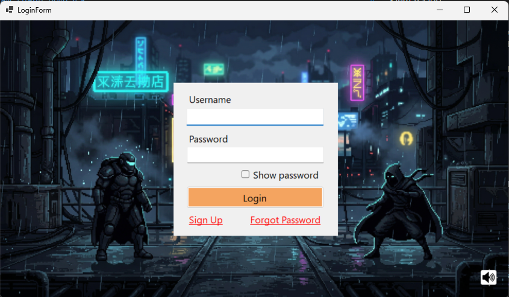

# NT106.Q23.ANTT — LẬP TRÌNH MẠNG CĂN BẢN


## I. Đồ Án Môn Học

**Tên đề tài:** Thiết kế và xây dựng game đối kháng 2D bằng C# trên nền tảng .NET Windows Forms

---

## Danh Sách Thành Viên

| STT | Họ và tên | MSSV | Vai trò |
|---|---|---|---|
| 1 | Lưu Hồng Phúc | 24521382 | Game Architect / Server |
| 2 | Phan Thái Hưng | 24520624 | Gameplay Programmer |
| 3 | Nguyễn Tấn Phát | 24521306 | UI / UX Game Developer |
| 4 | Nguyễn Phan Hoàng Long | 24521006 | Network Programmer |

---

## Mô Tả Tổng Quan

BattleGame là game đối kháng 2D theo thời gian thực qua mạng, được xây dựng bằng C# và Windows Forms. Hai người chơi kết nối tới server trung tâm qua Load Balancer, chọn nhân vật, được ghép cặp tự động và thi đấu thông qua giao tiếp TCP Socket.

### Các tính năng chính

- Đăng ký tài khoản với xác thực OTP qua Email (SMTP)
- Đăng nhập / xác thực tài khoản người chơi (BCrypt)
- Quên mật khẩu / đặt lại mật khẩu qua OTP Email
- Mã hóa toàn bộ gói tin bằng AES-256-CBC
- Load Balancer TCP (Round Robin) phân phối client vào các GameServer
- Health Check tự động loại bỏ server chết khỏi pool
- Hệ thống matchmaking tự động ghép 2 người chơi vào cùng một phòng
- Bot AI tự động thay thế khi không đủ người chơi (NoPlayer mode)
- Trận đấu real-time: di chuyển, tấn công, sử dụng kỹ năng
- Đồng bộ trạng thái game liên tục giữa server và các client (50ms/tick)
- Hiển thị animation nhân vật và hiệu ứng chiến đấu
- Hệ thống âm thanh BGM và SFX
- Lịch sử trận đấu và bảng xếp hạng

### Công nghệ sử dụng

| Thành phần | Công nghệ |
|---|---|
| Ngôn ngữ lập trình | C# (.NET 8) |
| Giao diện | Windows Forms |
| Giao tiếp mạng | TCP Socket (`System.Net.Sockets`) |
| Serialization | Custom `PacketSerializer` (JSON) |
| Mã hóa truyền tin | AES-256-CBC (`System.Security.Cryptography`) |
| Load Balancing | TCP Round Robin (custom) |
| Cơ sở dữ liệu | PostgreSQL 15 |
| Xác thực mật khẩu | BCrypt (`BCrypt.Net-Next`) |
| Gửi Email OTP | SMTP Gmail / Mailpit (dev local) |
| Container | Docker + Docker Compose |
| Kiểm thử | xUnit (`BattleGame.Test`) |

---

## Yêu Cầu Hệ Thống

| Công cụ | Phiên bản | Ghi chú |
|---|---|---|
| Docker Desktop | 4.x trở lên | Bắt buộc để chạy Server + LB + DB + Mailpit |
| .NET SDK | 8.0 | Chỉ cần nếu chạy Client hoặc build tay |
| Visual Studio | 2022 | Để phát triển |
| Windows | 10/11 64-bit | Để chạy Client WinForms |

---

## Sơ đồ kiến trúc hệ thống

---

## Hướng Dẫn Cài Đặt & Chạy

### 1. Clone dự án

```bash
git clone https://github.com/FUCLU/BattleGame.git
cd BattleGameSolution
```

### 2. Tạo file .env

> File `.env` chứa mật khẩu DB và không được commit lên Git. Phải tạo thủ công sau khi clone.

```bash
cp .env.example .env
```

Mở file `.env` và điền thông tin:

```env
# PostgreSQL
POSTGRES_DB=battlegame
POSTGRES_USER=postgres
POSTGRES_PASSWORD=your_password_here

# Server
SERVER_PORT=9001

# SMTP — dev local dùng Mailpit (giữ nguyên, không cần sửa)
SMTP_HOST=mailpit
SMTP_PORT=1025
SMTP_USERNAME=test@battlegame.local
SMTP_PASSWORD=
SMTP_ENABLE_SSL=false
```

### 3. Cài NuGet packages (chỉ làm 1 lần)

```bash
dotnet restore
```

### 4. Chạy Server + LoadBalancer + DB bằng Docker

```bash
# Lần đầu hoặc sau khi thay đổi code
docker compose up --build

# Các lần sau (không đổi code)
docker compose up -d
```

Sau khi chạy:

| Service | Địa chỉ | Mô tả |
|---|---|---|
| Load Balancer | `localhost:9000` | Entry point cho Client |
| Game Server | `localhost:9001` | GameServer (Docker nội bộ) |
| PostgreSQL | `localhost:5433` | Database |
| Mailpit Web UI | http://localhost:8025 | Xem email OTP |
| Mailpit SMTP | `localhost:1025` | SMTP dev local |

Kiểm tra log:
```bash
docker compose logs server       # log game server
docker compose logs loadbalancer # log load balancer
docker compose logs db           # log database
docker compose logs mailpit      # log email
```

Dừng server:
```bash
docker compose down       # dừng, giữ data
docker compose down -v    # dừng và xóa toàn bộ data DB
```

### 5. Chạy Client (WinForms)

> Client **không** chạy trong Docker. Chạy trực tiếp trên máy Windows.
> Client mặc định kết nối `127.0.0.1:9000` (Load Balancer).

**Cách 1 — Visual Studio:**
1. Mở `BattleGameSolution.slnx`
2. Chuột phải `BattleGame.Client` → **Set as Startup Project**
3. Nhấn **F5**

**Cách 2 — Terminal:**
```bash
dotnet run --project BattleGame.Client
```

> Mở 2 cửa sổ Client để thử nghiệm matchmaking Online.

### 6. Debug Server bằng Visual Studio (không dùng Docker)

> Dùng khi muốn đặt breakpoint debug trực tiếp trên server.

1. Chạy chỉ DB và Mailpit trong Docker:
```bash
docker compose up -d db mailpit
```

2. Đảm bảo `BattleGame.Server/Properties/launchSettings.json` có:
```json
{
  "profiles": {
    "BattleGame.Server": {
      "commandName": "Project",
      "environmentVariables": {
        "ASPNETCORE_ENVIRONMENT": "Development"
      }
    }
  }
}
```

3. Chuột phải `BattleGame.Server` → **Set as Startup Project** → nhấn **F5**

| Môi trường | `ASPNETCORE_ENVIRONMENT` | Host DB |
|---|---|---|
| Visual Studio | `Development` | `localhost` |
| Docker | `Production` | `db` |

### 7. Test Load Balancer với 2 GameServer

Thêm `server2` vào `docker-compose.yml` khi muốn demo Round Robin:

```bash
docker compose up --build --scale server=2
```

Hoặc thêm thủ công `server2` trong `docker-compose.yml` và cập nhật `BattleGame.LoadBalancer/appsettings.json`:

```json
{
  "LoadBalancer": {
    "Port": 9000,
    "HealthCheckIntervalSeconds": 5,
    "Servers": [
      { "Host": "battlegame_server",  "PublicHost": "localhost", "Port": 9001 },
      { "Host": "battlegame_server2", "PublicHost": "localhost", "Port": 9002 }
    ]
  }
}
```

### 8. Chạy Test

```bash
# Chạy tất cả test
dotnet test BattleGame.Test

# Chỉ test AES Encryption
dotnet test BattleGame.Test --filter "FullyQualifiedName~AesEncryptionTests"

# Chỉ test PacketSerializer
dotnet test BattleGame.Test --filter "FullyQualifiedName~PacketSerializerTests"

# Chỉ test LoadBalancer
dotnet test BattleGame.Test --filter "FullyQualifiedName~LoadBalancerTests"
```

---

## Cấu Trúc Dự Án

```
BattleGameSolution/
│
├── BattleGame.Client/                  # Ứng dụng client (WinForms)
│   ├── Assets/                         # Tài nguyên load lúc runtime
│   │   ├── Background/                 # Ảnh nền các màn hình
│   │   │   ├── Exit.png
│   │   │   ├── Mode.png
│   │   │   ├── Name.png
│   │   │   ├── Play.png
│   │   │   ├── loa.png
│   │   │   ├── login.png
│   │   │   └── menu.png
│   │   ├── Characters/                 # Spritesheet nhân vật
│   │   ├── Sounds/
│   │   │   ├── BGM/                    # Nhạc nền
│   │   │   │   └── montagem_hiraki.mp3
│   │   │   └── SFX/                    # Hiệu ứng âm thanh
│   │   └── UI/                         # Ảnh giao diện
│   ├── Config/
│   │   └── ClientConfig.cs             # Cấu hình IP/Port server
│   ├── Forms/
│   │   ├── LoginForm.cs                # Đăng nhập
│   │   ├── RegisterForm.cs             # Đăng ký tài khoản
│   │   ├── OtpForm.cs                  # Nhập mã OTP 6 số (có countdown)
│   │   ├── ForgotPasswordForm.cs       # Quên mật khẩu → nhận OTP
│   │   ├── ResetPasswordForm.cs        # Đặt lại mật khẩu mới
│   │   ├── MenuForm.cs                 # Màn hình chính
│   │   ├── ModeForm.cs                 # Chọn chế độ chơi
│   │   ├── CharacterSelection.cs       # Chọn nhân vật
│   │   ├── RoomForm.cs                 # Phòng chờ ghép cặp
│   │   ├── MapSelectionForm.cs         # Chọn bản đồ
│   │   ├── GameForm.cs                 # Màn hình trận đấu
│   │   ├── RoundStartForm.cs           # Màn hình bắt đầu round
│   │   ├── RoundEndForm.cs             # Màn hình kết thúc round
│   │   ├── GameOverForm.cs             # Màn hình kết thúc trận
│   │   ├── LeaderboardForm.cs          # Bảng xếp hạng
│   │   └── MatchHistoryForm.cs         # Lịch sử trận đấu
│   ├── Game/
│   │   ├── GameEngine.cs               # Vòng lặp game (60fps)
│   │   ├── GameStateManager.cs         # Quản lý trạng thái game
│   │   ├── AnimationManager.cs         # Quản lý animation spritesheet
│   │   └── CharacterRenderer.cs        # Render nhân vật lên màn hình
│   ├── Managers/
│   │   ├── InputManager.cs             # Xử lý input bàn phím
│   │   ├── SoundManager.cs             # Quản lý âm thanh BGM/SFX
│   │   ├── AssetManager.cs             # Tải và cache tài nguyên
│   │   └── NetworkManager.cs           # Trung gian gửi/nhận packet
│   ├── Network/
│   │   ├── ClientSocket.cs             # Kết nối TCP: LB → redirect → GameServer
│   │   ├── MatchmakingClient.cs        # Gửi yêu cầu tìm trận
│   │   └── PacketHandler.cs            # Xử lý packet nhận từ server
│   ├── Security/
│   │   └── AesEncryption.cs            # Bản sao AesEncryption (Client-side)
│   └── Program.cs                      # Entry point: connect LB → mở LoginForm
│
├── BattleGame.LoadBalancer/            # Load Balancer TCP (port 9000)
│   ├── Health/
│   │   └── HealthChecker.cs            # Ping GameServer mỗi 5s, loại server chết
│   ├── Network/
│   │   └── LoadBalancerSocket.cs       # TcpListener port 9000, nhận client
│   ├── Routing/
│   │   ├── RoundRoubinRouter.cs        # Round Robin: GetNext(), Register(), Remove()
│   │   └── Redirect.cs                 # Gửi PublicHost:Port về client rồi đóng kết nối
│   ├── LoadBalancerConfig.cs           # Config: Port, HealthCheckInterval, Servers[]
│   ├── Program.cs                      # Entry point: khởi động LB + HealthChecker
│   ├── appsettings.json                # Danh sách GameServer (Host nội bộ + PublicHost)
│   └── Dockerfile                      # Docker image cho LoadBalancer
│
├── BattleGame.Server/                  # Game Server (chạy trong Docker, port 9001)
│   ├── Config/
│   │   └── ServerConfig.cs             # Đọc appsettings + env: Port, DB, SMTP
│   ├── Database/
│   │   ├── DbInitializer.cs            # Tạo bảng khi server khởi động
│   │   ├── UserRepository.cs           # CRUD bảng users (FindByUsername, Save...)
│   │   ├── OtpRepository.cs            # CRUD bảng otp_tokens (Save, FindValid...)
│   │   └── MatchRepository.cs          # Lưu kết quả trận đấu
│   ├── Game/
│   │   ├── PacketProcessor.cs          # Dispatch packet → handler tương ứng
│   │   ├── GameManager.cs              # Dictionary<roomId, GameRoom> toàn server
│   │   ├── GameModeManager.cs          # Online / NoPlayer (Bot) mode
│   │   ├── GameRoom.cs                 # Session 2 người, sync state 50ms/tick
│   │   ├── BattleEngine.cs             # Vòng lặp server tick, cập nhật GameState
│   │   ├── CombatSystem.cs             # Tính toán damage, skill, combat logic
│   │   ├── BotAI.cs                    # AI bot thay thế khi thiếu người chơi
│   │   └── Match.cs                    # Object lưu kết quả trận (winner, loser...)
│   ├── Logging/
│   │   └── ServerLogger.cs             # Log ra console theo level INFO/WARN/ERROR
│   ├── Network/
│   │   ├── GameServer.cs               # TcpListener port 9001, AcceptTcpClient loop
│   │   ├── ServerSocket.cs             # Wrap TcpClient, kế thừa BaseSocket (có AES)
│   │   └── ClientHandler.cs            # 1 thread/client, giữ session (UserId, RoomId...)
│   ├── Services/
│   │   ├── AuthService.cs              # Login (BCrypt.Verify) → trả UserId+Username
│   │   ├── OtpService.cs               # SendOtp (sinh mã, hash, gửi email), VerifyOtp
│   │   ├── EmailService.cs             # Gửi email qua SMTP
│   │   └── MatchmakingService.cs       # Queue ghép cặp, tạo GameRoom khi đủ 2 người
│   ├── Program.cs                      # Entry point: load config → init DB → start server
│   ├── appsettings.json                # Config Production (Host=db)
│   ├── appsettings.Development.json    # Config Development (Host=localhost)
│   └── Dockerfile                      # Docker image cho GameServer
│
├── BattleGame.Shared/                  # Thư viện dùng chung Client + Server
│   ├── Config/
│   │   └── GameConstants.cs            # Hằng số: ServerHost, ServerPort(9000), TickRateMs(50)
│   ├── Models/
│   │   ├── Character.cs                # Thông tin nhân vật: HP, ATK, DEF, SPEED
│   │   ├── CharacterState.cs           # Trạng thái nhân vật trong trận
│   │   ├── Player.cs                   # Thông tin người chơi
│   │   ├── PlayerState.cs              # Trạng thái realtime của người chơi
│   │   ├── GameState.cs                # Snapshot toàn bộ trạng thái trận tại 1 tick
│   │   └── Skill.cs                    # Kỹ năng: damage, cooldown, type
│   ├── Network/
│   │   ├── BaseSocket.cs               # Gửi/nhận packet: length-prefix + AES encrypt/decrypt
│   │   └── PacketSerializer.cs         # Serialize/deserialize packet ↔ JSON
│   ├── Packets/
│   │   ├── Packet.cs                   # Base class cho tất cả packet
│   │   ├── PacketType.cs               # Enum 16 loại packet (Login=1 ... Disconnect=16)
│   │   ├── LoginPacket.cs              # Client→Server: username, password
│   │   ├── LoginResultPacket.cs        # Server→Client: success, message
│   │   ├── RegisterPacket.cs           # Client→Server: username, password, email
│   │   ├── OtpPacket.cs                # Server→Client: status (pending/success/fail), message
│   │   ├── OtpVerifyPacket.cs          # Client→Server: email, code 6 số, isReset
│   │   ├── ForgotPasswordPacket.cs     # Client→Server: email
│   │   ├── ResetPasswordPacket.cs      # Client→Server: email, newPassword
│   │   ├── MatchRequestPacket.cs       # Client→Server: yêu cầu tìm trận
│   │   ├── MatchFoundPacket.cs         # Server→Client: Player1Id, Player2Id
│   │   ├── SelectionCharacterPacket.cs # Client→Server: chọn nhân vật
│   │   ├── MovePacket.cs               # Client→Server: di chuyển
│   │   ├── AttackPacket.cs             # Client→Server: tấn công
│   │   ├── GameStatePacket.cs          # Server→Client: sync state mỗi 50ms
│   │   ├── HealthUpdatePacket.cs       # Server→Client: cập nhật HP
│   │   ├── GameOverPacket.cs           # Server→Client: kết thúc trận
│   │   └── DisconnectPacket.cs         # Client↔Server: ngắt kết nối có chủ ý
│   ├── Security/
│   │   └── AesEncryption.cs            # AES-256-CBC: Encrypt(json)→Base64, Decrypt(Base64)→json
│   └── Utils/
│       └── Logger.cs                   # Logger dùng chung với timestamp
│
├── BattleGame.Test/                    # Unit tests + Integration tests
│   ├── Integration/
│   │   └── MatchmakingIntegrationTests.cs  # E2E: 2 client → LOGIN → MATCH_REQUEST → ghép cặp
│   ├── LoadBalancerTests.cs                # Round Robin phân phối đều, Health remove server chết
│   ├── Server/
│   │   ├── AuthServiceTests.cs             # Test login đúng/sai, BCrypt verify
│   │   ├── BotAITest.cs                    # Test logic bot AI
│   │   └── CombatSystemTests.cs            # Test tính damage, skill
│   └── Shared/
│       ├── AesEncryptionTests.cs           # Test encrypt→decrypt, IV ngẫu nhiên
│       └── PacketSerializerTests.cs        # Test serialize/deserialize 16 packet type
│
├── scripts/
│   └── init.sql                        # Tạo bảng users, matches, otp_tokens khi DB boot
├── docker-compose.yml                  # Orchestrate: DB + Mailpit + Server + LoadBalancer
├── .env                                # Biến môi trường (KHÔNG commit lên Git)
├── .env.example                        # Template .env
├── .gitignore
├── BattleGameSolution.slnx
├── image.png                           # Sơ đồ kiến trúc hệ thống
└── README.md
```

---

## Chế Độ Chơi

| Chế độ | Điều kiện | Mô tả |
|---|---|---|
| Online | 2 người chơi online | Matchmaking ghép 2 người vào cùng phòng |
| No Player | 1 người chơi | Bot AI tự động thay thế người chơi thứ 2 |

---

## Luồng Hoạt Động

### Luồng Kết Nối qua Load Balancer

```
Client
  │── kết nối TCP ──► LoadBalancer :9000
  │◄── "localhost:9001" ──────────────── (plain text, đóng kết nối)
  │── kết nối TCP ──► GameServer :9001
  │  (từ đây toàn bộ packet đều mã hóa AES-256-CBC)
```

### Luồng Đăng Ký & OTP

```
Client                          Server                      Email (SMTP)
  │──── RegisterPacket ────────►│                              │
  │     (username, password,    │──── OtpService.SendOtp() ───►│
  │      email)                 │     sinh mã 6 số, BCrypt hash│
  │                             │     lưu otp_tokens           │
  │◄─── OtpPacket(pending) ─────│     gửi email OTP ──────────►│
  │                             │                              │
  │──── OtpVerifyPacket ───────►│                              │
  │     (mã 6 số)               │──── BCrypt.Verify()          │
  │                             │──── UserRepository.Save()    │
  │◄─── OtpPacket(success) ─────│                              │
```

### Luồng Quên Mật Khẩu

```
Client                        Server
  │──── ForgotPasswordPacket ──►│──── OtpService.SendOtp() ───► Email
  │◄─── OtpPacket(pending) ─────│
  │──── OtpVerifyPacket ───────►│──── BCrypt.Verify()
  │◄─── OtpPacket(success) ─────│
  │──── ResetPasswordPacket ───►│──── BCrypt.Hash() → DB
  │◄─── OtpPacket(success) ─────│
```

### Luồng Trận Đấu

```
Client A                    Server                      Client B
   │──── LoginPacket ───────►│◄──── LoginPacket ──────────│
   │◄─── LoginResultPacket ──│───── LoginResultPacket ───►│
   │──── MatchRequestPacket ►│◄─── MatchRequestPacket ────│
   │              [Ghép cặp — tạo GameRoom]               │
   │◄─── MatchFoundPacket ───│───── MatchFoundPacket ────►│
   │──── SelectionCharPacket►│◄── SelectionCharPacket ────│
   │                                                      │
   │══════════ Vòng lặp trận đấu (50ms/tick) ════════════ │
   │──── MovePacket ────────►│                            │
   │                         │───── GameStatePacket ────► │
   │──── AttackPacket ──────►│                            │
   │◄─── HealthUpdatePacket ─│                            │
   │◄─── GameOverPacket ─────│───── GameOverPacket ─────► │
   │═════════════════════════════════════════════════════ │
   │──── DisconnectPacket ──►│◄─── DisconnectPacket ───── │
```

---

## Giao Thức Mạng

> Tất cả packet được mã hóa AES-256-CBC trước khi gửi qua TCP (trừ redirect từ LoadBalancer).

| Packet | Hướng | Type | Mô tả |
|---|---|---|---|
| `LoginPacket` | Client → Server | 1 | Gửi username + password |
| `LoginResultPacket` | Server → Client | 2 | Kết quả xác thực |
| `RegisterPacket` | Client → Server | 3 | Đăng ký: username, password, email |
| `OtpPacket` | Server → Client | 4 | Thông báo OTP (pending/success/fail) |
| `OtpVerifyPacket` | Client → Server | 5 | Gửi mã OTP 6 số |
| `ForgotPasswordPacket` | Client → Server | 6 | Yêu cầu OTP reset mật khẩu |
| `ResetPasswordPacket` | Client → Server | 7 | Đặt mật khẩu mới |
| `MatchRequestPacket` | Client → Server | 8 | Yêu cầu tìm trận |
| `MatchFoundPacket` | Server → Client | 9 | Ghép cặp thành công |
| `SelectionCharacterPacket` | Client → Server | 10 | Chọn nhân vật |
| `MovePacket` | Client → Server | 11 | Di chuyển |
| `AttackPacket` | Client → Server | 12 | Tấn công |
| `GameStatePacket` | Server → Client | 13 | Sync state mỗi 50ms |
| `HealthUpdatePacket` | Server → Client | 14 | Cập nhật HP |
| `GameOverPacket` | Server → Client | 15 | Kết thúc trận |
| `DisconnectPacket` | Client ↔ Server | 16 | Ngắt kết nối |

---

## Cấu hình Email OTP

**Dev local (mặc định):** Dùng **Mailpit** — không gửi email thật.
- Xem email tại: **http://localhost:8025**
- Không cần cấu hình thêm, chạy `docker compose up` là xong.

**Production (Gmail):** Tạo file `BattleGame.Server/appsettings.Production.json`:

```json
{
  "Smtp": {
    "Host": "smtp.gmail.com",
    "Port": 587,
    "Username": "your.email@gmail.com",
    "Password": "xxxx xxxx xxxx xxxx",
    "FromName": "BattleGame",
    "EnableSsl": true
  }
}
```

> **Lấy Gmail App Password:** Google Account → Security → 2-Step Verification → App Passwords → Mail → Copy 16 ký tự. **KHÔNG commit file này lên Git.**

---

## Xử Lý Sự Cố

**Quên tạo file .env:**
```bash
cp .env.example .env
docker compose up -d
```

**Bảng DB chưa được tạo:**
```bash
docker compose down -v
docker compose up -d
```

**Port 9000 bị chiếm (LoadBalancer không start được):**
```bash
netstat -ano | findstr :9000
taskkill /f /pid <PID>
docker compose up
```

**Client báo "No such host is known":**
- Kiểm tra `BattleGame.LoadBalancer/appsettings.json` có `PublicHost: "localhost"` chưa
- Rebuild: `docker compose down --rmi all && docker compose build && docker compose up`

**Server báo IOException liên tục:**
- Đây là bình thường — mỗi kết nối từ LoadBalancer (đóng ngay sau redirect) tạo ra 1 IOException
- Kết nối thật từ Client sẽ không có lỗi này

**Không nhận được email OTP:**
```bash
docker compose logs mailpit
# Mở http://localhost:8025 để xem email
```

**Reset toàn bộ:**
```bash
docker compose down -v
docker compose build --no-cache
docker compose up
```