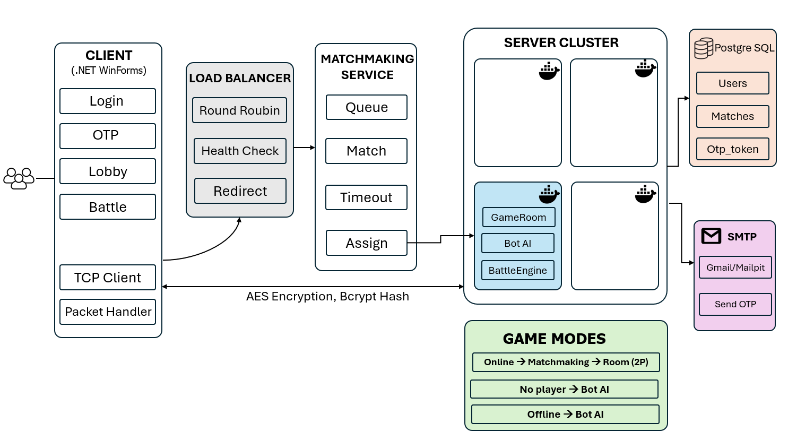
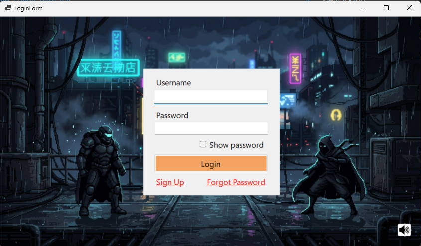

# NT106.Q23.ANTT — LẬP TRÌNH MẠNG CĂN BẢN


## I. Đồ Án Môn Học

**Tên đề tài:** Thiết kế và xây dựng game đối kháng 2D bằng C# trên nền tảng .NET Windows Forms

---

## Danh Sách Thành Viên

| STT | Họ và tên | MSSV | Vai trò |
|---|---|---|---|
| 1 | Lưu Hồng Phúc | 24521382 | Game Architect / Server |
| 2 | Phan Thái Hưng | 24520624 | Gameplay Programmer |
| 3 | Nguyễn Tấn Phát | 24521306 | UI / UX Game Developer |
| 4 | Nguyễn Phan Hoàng Long | 24521006 | Network Programmer |

---

## Mô Tả Tổng Quan

BattleGame là game đối kháng 2D theo thời gian thực qua mạng, được xây dựng bằng C# và Windows Forms. Hai người chơi kết nối tới server thông qua Load Balancer, chọn nhân vật, vào phòng và thi đấu thông qua giao tiếp TCP Socket với mã hóa AES-256-CBC toàn bộ gói tin.

### Các tính năng chính

- Đăng ký tài khoản với xác thực OTP qua Email (SMTP)
- Đăng nhập / xác thực bằng BCrypt
- Quên mật khẩu / đặt lại mật khẩu qua OTP Email
- Mã hóa toàn bộ gói tin bằng AES-256-CBC
- Load Balancer TCP (Round Robin + User/Room Affinity) phân phối client vào các Game Server
- Health Check tự động loại bỏ server chết khỏi pool (dựa trên Redis heartbeat)
- Hệ thống phòng: tạo phòng, tham gia, chọn nhân vật, chọn map, đặt mật khẩu phòng
- Auto Matchmaking ghép 2 người chơi tự động vào cùng một phòng
- Trận đấu best-of-3 real-time: di chuyển, tấn công, kỹ năng, dash, block, sudden death
- Simulation server-authoritative chạy 60 tick/s, broadcast WorldState mỗi 2 tick
- Client-side prediction cho action của local player (attack/skill/dash)
- 7 nhân vật chơi được, mỗi nhân vật có 2 kỹ năng và bộ stats riêng
- Chế độ Offline: 1v1 local 2 người, 1v1 vs máy
- Chế độ Dungeon: boss wave-based, parallax map, 4 boss độc lập
- Hệ thống âm thanh BGM và SFX (NAudio)
- Lịch sử trận đấu và bảng xếp hạng
- Chat trong phòng chờ

### Công nghệ sử dụng

| Thành phần | Công nghệ |
|---|---|
| Ngôn ngữ lập trình | C# (.NET 8) |
| Giao diện | Windows Forms |
| Giao tiếp mạng | TCP Socket (`System.Net.Sockets`) |
| Serialization | Custom `PacketSerializer` (JSON) |
| Mã hóa truyền tin | AES-256-CBC (`System.Security.Cryptography`) |
| Load Balancing | TCP Round Robin + Affinity (custom) |
| Session Store | Redis 7 (phòng, user affinity, server heartbeat) |
| Cơ sở dữ liệu | PostgreSQL 15 |
| Xác thực mật khẩu | BCrypt (`BCrypt.Net-Next`) |
| Gửi Email OTP | SMTP Gmail / Mailpit (dev local) |
| Âm thanh | NAudio 2.3 |
| Container | Docker + Docker Compose |

---

## Yêu Cầu Hệ Thống

| Công cụ | Phiên bản | Ghi chú |
|---|---|---|
| Docker Desktop | 4.x trở lên | Bắt buộc để chạy Server + LB + DB + Redis + Mailpit |
| .NET SDK | 8.0 | Chỉ cần nếu chạy Client hoặc build tay |
| Visual Studio | 2022 | Để phát triển |
| Windows | 10/11 64-bit | Để chạy Client WinForms |

---

## Sơ đồ kiến trúc hệ thống


---

## Hướng Dẫn Cài Đặt & Chạy

### 1. Clone dự án

```bash
git clone https://github.com/FUCLU/BattleGame.git
cd BattleGame
```

### 2. Tạo file .env

> File `.env` chứa thông tin DB và không được commit lên Git. Phải tạo thủ công sau khi clone.

Tạo file `.env` tại thư mục gốc với nội dung:

```env
# PostgreSQL
POSTGRES_DB=battlegame
POSTGRES_USER=postgres
POSTGRES_PASSWORD=your_password_here

# Public host cho client kết nối vào (dùng 127.0.0.1 nếu chạy local)
PUBLIC_HOST=127.0.0.1

# Port public cho từng game server (client sẽ được redirect vào đây)
GAME_PUBLIC_PORT=9999
GAME2_PUBLIC_PORT=10000

# Port public cho load balancer
LB_PUBLIC_PORT=9090

# Log level: DEBUG / INFO / WARN / ERROR
LOG_LEVEL=INFO
LOG_INPUT_PACKETS=false
```

### 3. Cài NuGet packages (chỉ làm 1 lần)

```bash
dotnet restore
```

### 4. Chạy Server + LoadBalancer + DB bằng Docker

```bash
# Lần đầu hoặc sau khi thay đổi code server
docker compose up --build

# Các lần sau (không đổi code server)
docker compose up -d
```

Sau khi chạy:

| Service | Địa chỉ | Mô tả |
|---|---|---|
| Load Balancer | `localhost:9090` | Entry point cho Client |
| Game Server 1 | `localhost:9999` | Redirect từ LB |
| Game Server 2 | `localhost:10000` | Redirect từ LB |
| PostgreSQL | `localhost:5433` | Database |
| Redis | `localhost:6379` | Session store |
| Mailpit Web UI | `http://localhost:8025` | Xem email OTP |
| Mailpit SMTP | `localhost:1025` | SMTP dev local |

Kiểm tra log:
```bash
docker compose logs server        # log game server 1
docker compose logs server2       # log game server 2
docker compose logs loadbalancer  # log load balancer
docker compose logs db            # log database
docker compose logs mailpit       # log email
```

Dừng server:
```bash
docker compose down       # dừng, giữ data
docker compose down -v    # dừng và xóa toàn bộ data DB
```

### 5. Cấu hình Client

Client đọc cấu hình từ file `BattleGame.Client/clientsettings.json`. Mặc định đang dùng profile `Internet`. Để chạy local, đổi `ActiveProfile` thành `Local`:

```json
{
  "ActiveProfile": "Local",
  "Profiles": {
    "Local": {
      "ServerHost": "127.0.0.1",
      "ServerPort": 9090
    },
    "Lan": {
      "ServerHost": "192.168.x.x",
      "ServerPort": 9090
    },
    "Internet": {
      "ServerHost": "your.server.ip",
      "ServerPort": 9090
    }
  }
}
```

Hoặc dùng biến môi trường để override không cần sửa file:
```bash
set BATTLEGAME_SERVER_HOST=127.0.0.1
set BATTLEGAME_SERVER_PORT=9090
```

### 6. Chạy Client (WinForms)



> Client **không** chạy trong Docker. Chạy trực tiếp trên máy Windows.

**Cách 1 — Visual Studio:**
1. Mở `BattleGameSolution.slnx`
2. Chuột phải `BattleGame.Client` → **Set as Startup Project**
3. Nhấn **F5**

**Cách 2 — Terminal:**
```bash
dotnet run --project BattleGame.Client
```

> Mở 2 cửa sổ Client để thử nghiệm matchmaking Online.

### 7. Debug Server bằng Visual Studio (không dùng Docker)

> Dùng khi muốn đặt breakpoint debug trực tiếp trên server.

1. Chạy chỉ DB, Redis và Mailpit trong Docker:
```bash
docker compose up -d db redis mailpit
```

2. Đảm bảo `BattleGame.Server/appsettings.Development.json` trỏ đúng localhost:

```json
{
  "ConnectionStrings": {
    "DefaultConnection": "Host=localhost;Port=5433;Database=battlegame;Username=postgres;Password=your_password_here"
  },
  "Smtp": {
    "Mode": "Mailpit",
    "Mailpit": {
      "Host": "localhost",
      "Port": 1025
    }
  }
}
```

3. Set `ASPNETCORE_ENVIRONMENT=Development` trong launch profile, sau đó:
   - Chuột phải `BattleGame.Server` → **Set as Startup Project** → nhấn **F5**

| Môi trường | `ASPNETCORE_ENVIRONMENT` | Host DB | Host Redis |
|---|---|---|---|
| Visual Studio | `Development` | `localhost:5433` | `localhost:6379` |
| Docker | *(không set)* | `db:5432` | `redis:6379` |

---

## Cấu Trúc Dự Án

```
BattleGame/
│
├── BattleGame.Client/                  # Ứng dụng client (WinForms)
│   ├── Assets/                         # Tài nguyên load lúc runtime
│   │   ├── Background/                 # Ảnh nền các màn hình
│   │   ├── Characters/                 # Spritesheet nhân vật (Samurai, Kitsune, ...)
│   │   ├── dungeon/                    # Assets dungeon (parallax layers, objects.json)
│   │   ├── PotraitPic/                 # Ảnh chân dung nhân vật
│   │   ├── Sounds/
│   │   │   ├── BGM/                    # Nhạc nền (montagem_hiraki.mp3, darren_hirst.mp3, ...)
│   │   │   └── SFX/                    # Hiệu ứng âm thanh (.wav)
│   │   └── UI/                         # Ảnh giao diện
│   ├── Config/
│   │   ├── Characters/                 # JSON stats + skills từng nhân vật chơi được
│   │   │   ├── lord.json               # Lord — Fireball / Lightning
│   │   │   ├── samurai.json            # Samurai — Multi Slash / Blade Wave
│   │   │   ├── kitsune.json            # Kitsune — Barrier / Fire Burst
│   │   │   ├── wizard.json             # Wizard — Light Charge / Light Ball
│   │   │   ├── haladin.json            # Haladin — Judgement Slash / Holy Wrath
│   │   │   ├── heavycrystal.json       # HeavyCrystal — Crystal Crush / Crystal Burst
│   │   │   └── stonegolem.json         # Golem — Flying Obelisk / Laser Beam
│   │   ├── Bosses/                     # JSON stats boss dungeon (agis, cthulu, slimdemon, zweilander)
│   │   ├── BossAiProfiles/             # JSON profile điều khiển từng boss
│   │   ├── CharacterCatalog.cs         # Danh sách nhân vật client-side
│   │   └── CharacterDefinition.cs      # Deserialize JSON config nhân vật
│   ├── Forms/
│   │   ├── LoginForm.cs                # Đăng nhập
│   │   ├── RegisterForm.cs             # Đăng ký tài khoản
│   │   ├── OtpForm.cs                  # Nhập mã OTP 6 số (có countdown)
│   │   ├── ForgotPasswordForm.cs       # Quên mật khẩu → nhận OTP
│   │   ├── ResetPasswordForm.cs        # Đặt lại mật khẩu mới
│   │   ├── MenuForm.cs                 # Màn hình chính
│   │   ├── ModeForm.cs                 # Chọn chế độ chơi (Online/Offline/Dungeon)
│   │   ├── CharacterSelection.cs       # Chọn nhân vật
│   │   ├── JoinRoom.cs                 # Tham gia phòng theo ID
│   │   ├── RoomForm.cs                 # Phòng chờ (chat, ready, chọn nhân vật, chọn map)
│   │   ├── MapSelectionForm.cs         # Chọn bản đồ
│   │   ├── GameForm.cs                 # Màn hình trận đấu Online
│   │   ├── OfflineMode.cs              # Trận đấu Offline 2P local
│   │   ├── OfflineMode_CPU.cs          # Trận đấu Offline vs máy
│   │   ├── DungeonMode.cs              # Chế độ Dungeon
│   │   ├── Stage1Form.cs               # Dungeon Stage 1
│   │   ├── Stage2Form.cs               # Dungeon Stage 2
│   │   ├── VictoryForm.cs              # Màn hình thắng
│   │   ├── GameOverForm.cs             # Màn hình thua
│   │   ├── OfflineMatchResultForm.cs   # Kết quả trận offline
│   │   ├── InstructionForm.cs          # Hướng dẫn chơi
│   │   ├── LeaderboardForm.cs          # Bảng xếp hạng
│   │   ├── AudioSettingsForm.cs        # Cài đặt âm thanh
│   │   └── MatchHistoryForm.cs         # Lịch sử trận đấu
│   ├── Game/
│   │   ├── GameEngine.cs               # Vòng lặp game, render, camera, online snapshot
│   │   ├── Core/                       # Entity-Component system (Entity, IComponent)
│   │   │   └── Components/             # CharacterComponent, MovementComponent, SpriteComponent, ...
│   │   ├── AI/                         # BossAiController, BossAiProfile (điều khiển boss dungeon)
│   │   ├── Dungeon/                    # DungeonRunController, DungeonMapRegistry, DungeonContentLoader
│   │   ├── Gameplay/                   # CharacterFactory, CharacterHitbox, ProjectileFactory
│   │   ├── Input/                      # PlayerController (keyboard → action)
│   │   ├── Rendering/                  # CharacterRenderer, AnimationLoader, BarrierRenderer
│   │   └── Systems/                    # AnimationSystem, CombatSystem, MovementSystem, ProjectileSystem
│   ├── Managers/
│   │   ├── InputManager.cs             # Xử lý input bàn phím (global key state)
│   │   ├── SoundManager.cs             # Quản lý âm thanh BGM/SFX (NAudio)
│   │   ├── EntityManager.cs            # Quản lý vòng đời Entity
│   │   ├── NetworkManager.cs           # Singleton gửi/nhận packet, quản lý reconnect
│   │   └── PlayerSession.cs            # Lưu thông tin session người chơi hiện tại
│   ├── Network/
│   │   └── ClientSocket.cs             # Kết nối TCP → LB → nhận redirect → kết nối GameServer
│   └── Program.cs                      # Entry point: connect LB → mở LoginForm
│
├── BattleGame.LoadBalancer/            # Load Balancer TCP (port 9090)
│   ├── Health/
│   │   └── HealthChecker.cs            # Kiểm tra server alive qua Redis heartbeat TTL
│   ├── Logging/
│   │   └── LbLogger.cs                 # Structured log với level
│   ├── Network/
│   │   └── LoadBalancerSocket.cs       # TcpListener port 9090, nhận client và redirect
│   ├── Registry/
│   │   └── RedisBackendRegistry.cs     # Lưu server list + healthy status + user/room affinity trên Redis
│   ├── Routing/
│   │   ├── RoundRoubinRouter.cs        # Round Robin với ưu tiên affinity (user/room → server cũ)
│   │   └── Redirect.cs                 # Gửi "PublicHost:PublicPort" plain text rồi đóng kết nối
│   ├── LoadBalancerConfig.cs           # Config: Port, HealthCheckInterval, Redis, Servers[]
│   ├── Program.cs                      # Entry point: khởi động LB + HealthChecker
│   ├── appsettings.json                # Danh sách GameServer (Host nội bộ + PublicHost + PublicPort)
│   └── Dockerfile
│
├── BattleGame.Server/                  # Game Server (Docker, port 9001)
│   ├── Config/
│   │   ├── ServerConfig.cs             # Đọc env/appsettings: Port, ServerId, Redis, DB, SMTP
│   │   └── SmtpConfig.cs               # Cấu hình SMTP (Mode: Mailpit hoặc Real)
│   ├── Database/
│   │   ├── DbInitializer.cs            # Tạo bảng khi server khởi động
│   │   ├── UserRepository.cs           # CRUD bảng users
│   │   ├── OtpRepository.cs            # CRUD bảng otp_tokens
│   │   └── MatchRepository.cs          # Lưu kết quả trận đấu
│   ├── Game/
│   │   ├── PacketProcessor.cs          # Dispatch packet theo PacketType → handler
│   │   └── Match.cs                    # Object lưu kết quả trận (winner, loser, duration)
│   ├── Logging/
│   │   └── ServerLogger.cs             # Structured log với level INFO/WARN/ERROR/DEBUG
│   ├── Network/
│   │   ├── GameServer.cs               # TcpListener port 9001, AcceptTcpClient loop
│   │   ├── ServerSocket.cs             # Wrap TcpClient, kế thừa BaseSocket (có AES)
│   │   └── ClientHandler.cs            # 1 task/client, giữ session (UserId, RoomId)
│   ├── Services/
│   │   ├── AuthService.cs              # Login (BCrypt.Verify) → trả UserId + Username
│   │   ├── OtpService.cs               # SendOtp (sinh mã, hash, gửi email), VerifyOtp
│   │   ├── EmailService.cs             # Gửi email qua SMTP (Mailpit hoặc Gmail)
│   │   ├── MatchmakingService.cs       # Quản lý phòng, matchmaking, simulation loop
│   │   ├── RedisRoomStore.cs           # Lưu/đọc metadata phòng trên Redis
│   │   └── RedisServerRegistry.cs      # Gửi heartbeat lên Redis để LB biết server còn sống
│   ├── Program.cs                      # Entry point: load config → init DB → start server
│   ├── appsettings.json                # Config Production (Host=db, Host=redis)
│   ├── appsettings.Development.json    # Config Development (Host=localhost)
│   └── Dockerfile
│
├── BattleGame.Shared/                  # Thư viện dùng chung Client + Server
│   ├── Config/
│   │   └── GameConstants.cs            # Hằng số: ServerHost, ServerPort(9090), TickRateMs(50)
│   ├── Models/
│   │   ├── Player.cs                   # Thông tin người chơi (Id, Username)
│   │   └── SkillData.cs                # Dữ liệu kỹ năng: effects, cooldown, manaCost
│   ├── Network/
│   │   ├── BaseSocket.cs               # Gửi/nhận packet: length-prefix + AES encrypt/decrypt
│   │   └── PacketSerializer.cs         # Serialize/deserialize packet ↔ JSON theo PacketType
│   ├── Packets/                        # 35 loại packet (Login=1 ... Victory=35)
│   │   ├── Packet.cs                   # Base class: Type (PacketType)
│   │   ├── PacketType.cs               # Enum đầy đủ 35 loại
│   │   └── *.cs                        # LoginPacket, MovePacket, WorldStatePacket, ...
│   ├── Security/
│   │   └── AesEncryption.cs            # AES-256-CBC: Encrypt(json)→Base64, Decrypt(Base64)→json
│   └── Simulation/
│       ├── BattleSimulation.cs         # Engine vật lý deterministic (60 tick/s)
│       ├── BattleState.cs              # Snapshot trạng thái trận: players, projectiles, effects
│       ├── PlayerBattleState.cs        # Trạng thái realtime của từng người chơi
│       ├── BattleInput.cs              # Input packet đã parse: moveX, jump, attack, skill, dash
│       ├── BattleHitbox.cs             # Tính toán va chạm AABB
│       ├── BattleCharacterCatalog.cs   # Map networkId → characterId (0=lord, 1=samurai, ...)
│       ├── BattleCharacterStats.cs     # Stats nhân vật trong simulation
│       ├── ProjectileState.cs          # Trạng thái projectile
│       └── EffectState.cs              # Trạng thái effect (barrier, ...)
│
├── scripts/
│   └── init.sql                        # Tạo bảng users, matches, otp_tokens khi DB boot
├── docker-compose.yml                  # Orchestrate: DB + Redis + Mailpit + Server×2 + LoadBalancer
├── .env                                # Biến môi trường (KHÔNG commit lên Git)
├── BattleGameSolution.slnx             # Solution file (4 projects)
├── image.png                           # Sơ đồ kiến trúc hệ thống
└── README.md
```

---

## Chế Độ Chơi

| Chế độ | Điều kiện | Mô tả |
|---|---|---|
| Online PvP | 2 người chơi online | Tạo/tham gia phòng, matchmaking tự động, best-of-3 |
| Auto Match | 2 người chơi online | Matchmaking tự động không cần tạo phòng |
| Offline 2P | 2 người, 1 máy | Chơi local, điều khiển bàn phím riêng |
| Offline vs máy | 1 người | Đấu với máy tính |
| Dungeon | 1 người | Wave-based boss fight, 2 map parallax, 4 boss độc lập |

### Nhân vật chơi được (7 nhân vật)

| ID | Nhân vật | Kỹ năng |
|---|---|---|
| 0 | Lord | Fireball / Lightning |
| 1 | Samurai | Multi Slash / Blade Wave |
| 2 | Kitsune | Barrier / Fire Burst |
| 3 | Wizard | Light Charge / Light Ball |
| 4 | Haladin | Judgement Slash / Holy Wrath |
| 5 | HeavyCrystal | Crystal Crush / Crystal Burst |
| 6 | Golem | Flying Obelisk / Laser Beam |

### Boss Dungeon (4 boss)

| Boss | AI Profile |
|---|---|
| Agis | `agis.json` |
| Cthulu | `cthulu.json` |
| Slim Demon | `slimdemon.json` |
| Zweilander | `zweilander.json` |

### Bản đồ

| Map | Chế độ |
|---|---|
| Terrace | Online / Offline |
| Castle | Online / Offline |
| Forest | Online / Offline |
| Throne Room | Online / Offline |
| Dungeon Map 1 | Dungeon |
| Dungeon Map 2 | Dungeon |

---

## Luồng Hoạt Động

### Luồng Kết Nối qua Load Balancer

```
Client
  │── kết nối TCP ──────────► LoadBalancer :9090
  │◄── "127.0.0.1:9999" ──────────────────────── (plain text, length-prefix, đóng kết nối)
  │── kết nối TCP ──────────► GameServer :9999
  │  (từ đây toàn bộ packet đều mã hóa AES-256-CBC)
```

> LB ưu tiên affinity: nếu user hoặc room đã gắn với server nào, redirect về đúng server đó thay vì round robin.

### Luồng Đăng Ký & OTP

```
Client                          Server                      Email (SMTP)
  │──── RegisterPacket ────────►│                              │
  │     (username, password,    │──── OtpService.SendOtp() ───►│
  │      email)                 │     sinh mã 6 số, BCrypt hash│
  │                             │     lưu otp_tokens           │
  │◄─── OtpPacket(pending) ─────│     gửi email OTP ──────────►│
  │                             │                              │
  │──── OtpVerifyPacket ───────►│                              │
  │     (mã 6 số)               │──── BCrypt.Verify()          │
  │                             │──── UserRepository.Save()    │
  │◄─── OtpPacket(success) ─────│                              │
```

### Luồng Quên Mật Khẩu

```
Client                        Server
  │──── ForgotPasswordPacket ──►│──── OtpService.SendOtp() ───► Email
  │◄─── OtpPacket(pending) ─────│
  │──── OtpVerifyPacket ───────►│──── BCrypt.Verify()
  │◄─── OtpPacket(success) ─────│
  │──── ResetPasswordPacket ───►│──── BCrypt.Hash() → DB
  │◄─── OtpPacket(success) ─────│
```

### Luồng Trận Đấu Online

```
Client A                    Server                          Client B
   │──── LoginPacket ───────►│◄──── LoginPacket ──────────────│
   │◄─── LoginResultPacket ──│───── LoginResultPacket ────────►│
   │                         │                                 │
   │   [Tạo/tham gia phòng, chọn nhân vật, chọn map]         │
   │──── SelectMapPacket ───►│                                 │
   │──── SelectCharPacket ──►│◄─── SelectCharPacket ───────────│
   │                         │                                 │
   │         [Đủ điều kiện → đếm ngược 3s → StartMatch]       │
   │◄─── MatchFoundPacket ───│──────────────────────────────►  │
   │                         │                                 │
   │══════ Simulation loop 60 tick/s (BattleSimulation) ═════ │
   │──── InputPacket ───────►│                                 │
   │                         │──── WorldStatePacket ──────────►│
   │◄─── WorldStatePacket ───│                                 │
   │                         │  (broadcast mỗi 2 tick ≈ 33ms) │
   │                         │                                 │
   │◄─── VictoryPacket ──────│──── GameOverPacket ────────────►│
   │═══════════════════════════════════════════════════════════│
```

---

## Giao Thức Mạng

> Tất cả packet được mã hóa AES-256-CBC trước khi gửi qua TCP (trừ redirect plain text từ LoadBalancer).
> Định dạng: `[4 bytes length][N bytes AES-encrypted JSON]`

| Packet | Hướng | Type | Mô tả |
|---|---|---|---|
| `LoginPacket` | Client → Server | 1 | Gửi username + password |
| `LoginResultPacket` | Server → Client | 2 | Kết quả xác thực |
| `RegisterPacket` | Client → Server | 3 | Đăng ký: username, password, email |
| `OtpPacket` | Server → Client | 4 | Thông báo OTP (pending/success/fail) |
| `OtpVerifyPacket` | Client → Server | 5 | Gửi mã OTP 6 số |
| `ForgotPasswordPacket` | Client → Server | 6 | Yêu cầu OTP reset mật khẩu |
| `ResetPasswordPacket` | Client → Server | 7 | Đặt mật khẩu mới |
| `MatchRequestPacket` | Client → Server | 8 | Yêu cầu auto matchmaking |
| `MatchFoundPacket` | Server → Client | 9 | Ghép cặp thành công, bắt đầu trận |
| `SelectCharacterPacket` | Client → Server | 10 | Chọn nhân vật |
| `MovePacket` | Client → Server | 11 | Di chuyển (legacy) |
| `AttackPacket` | Client → Server | 12 | Tấn công (legacy) |
| `GameStatePacket` | Server → Client | 13 | Sync state (legacy) |
| `HealthUpdatePacket` | Server → Client | 14 | Cập nhật HP (legacy) |
| `GameOverPacket` | Server → Client | 15 | Kết thúc trận (người thua) |
| `DisconnectPacket` | Client ↔ Server | 16 | Ngắt kết nối có chủ ý |
| `CreateRoomPacket` | Client → Server | 17 | Tạo phòng |
| `CreateRoomResultPacket` | Server → Client | 18 | Kết quả tạo phòng |
| `GetRoomPacket` | Client → Server | 19 | Lấy danh sách phòng |
| `GetRoomResultPacket` | Server → Client | 20 | Danh sách phòng hiện có |
| `JoinRoomPacket` | Client → Server | 21 | Tham gia phòng |
| `JoinRoomResultPacket` | Server → Client | 22 | Kết quả tham gia phòng |
| `ReadyPacket` | Client → Server | 23 | Sẵn sàng (chọn xong nhân vật) |
| `SelectMapPacket` | Client → Server | 24 | Chọn bản đồ |
| `GetLeaderboardPacket` | Client → Server | 25 | Lấy bảng xếp hạng |
| `GetLeaderboardResultPacket` | Server → Client | 26 | Dữ liệu bảng xếp hạng |
| `RemoveRoomPacket` | Client → Server | 27 | Xóa phòng (chủ phòng) |
| `RemoveRoomResultPacket` | Server → Client | 28 | Kết quả xóa phòng |
| `LeaveRoomPacket` | Client → Server | 29 | Rời phòng |
| `InputPacket` | Client → Server | 30 | Input realtime (move/attack/skill/dash/block) |
| `WorldStatePacket` | Server → Client | 31 | Toàn bộ BattleState (broadcast mỗi 2 tick) |
| `HitEventPacket` | Server → Client | 32 | Sự kiện trúng đòn |
| `RoomClosedPacket` | Server → Client | 33 | Phòng bị đóng (chủ phòng rời) |
| `ChatMessagePacket` | Client ↔ Server | 34 | Chat trong phòng chờ |
| `VictoryPacket` | Server → Client | 35 | Kết thúc trận (người thắng) |

---

## Cấu hình Email OTP

**Dev local (mặc định):** Dùng **Mailpit** — không gửi email thật, xem tại `http://localhost:8025`. Không cần cấu hình thêm.

**Production (Gmail):** Thêm vào `BattleGame.Server/appsettings.json` phần `Smtp`:

```json
{
  "Smtp": {
    "Mode": "Real",
    "FromName": "BattleGame",
    "Real": {
      "Host": "smtp.gmail.com",
      "Port": 587,
      "FromEmail": "your.email@gmail.com",
      "Username": "your.email@gmail.com",
      "Password": "xxxx xxxx xxxx xxxx",
      "EnableSsl": true
    }
  }
}
```

Hoặc dùng biến môi trường trong `.env`:
```env
SMTP_MODE=Real
SMTP_REAL_HOST=smtp.gmail.com
SMTP_REAL_PORT=587
SMTP_REAL_FROM_EMAIL=your.email@gmail.com
SMTP_REAL_USERNAME=your.email@gmail.com
SMTP_REAL_PASSWORD=xxxx xxxx xxxx xxxx
```

> **Lấy Gmail App Password:** Google Account → Security → 2-Step Verification → App Passwords → Mail → Copy 16 ký tự. **KHÔNG commit file này lên Git.**

---

## Xử Lý Sự Cố

**Chưa có file .env:**
```bash
# Tạo thủ công từ nội dung mẫu ở phần "Tạo file .env" bên trên
docker compose up -d
```

**Bảng DB chưa được tạo:**
```bash
docker compose down -v
docker compose up -d
```

**Port bị chiếm:**
```bash
# Kiểm tra port 9090 (LoadBalancer)
netstat -ano | findstr :9090
taskkill /f /pid <PID>
docker compose up
```

**Client báo "No such host is known" hoặc không kết nối được:**
- Kiểm tra `clientsettings.json` đang dùng đúng profile, `ServerPort` là `9090`
- Kiểm tra Docker đang chạy: `docker compose ps`
- Rebuild: `docker compose down --rmi all && docker compose build && docker compose up`

**Client kết nối được LB nhưng không vào được GameServer:**
- Kiểm tra `PUBLIC_HOST` trong `.env` đúng IP máy host
- Kiểm tra `GAME_PUBLIC_PORT` trong `.env` khớp với port mapping trong `docker-compose.yml`

**Không nhận được email OTP:**
```bash
docker compose logs mailpit
# Mở http://localhost:8025 để xem email
```

**Server log báo "start match failed" khi bắt đầu trận:**
- Kiểm tra file JSON trong `Config/Characters/` đã copy vào output directory chưa
- Build lại server: `docker compose up --build server`

**Reset toàn bộ:**
```bash
docker compose down -v
docker compose build --no-cache
docker compose up
```